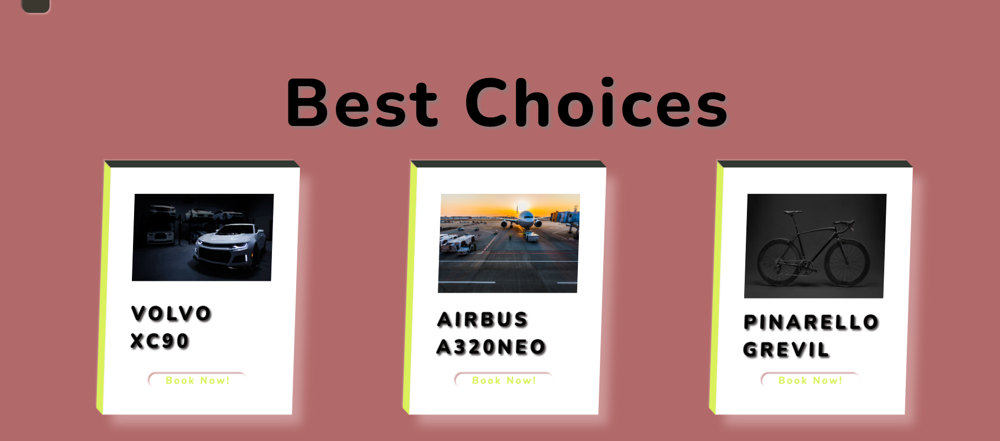
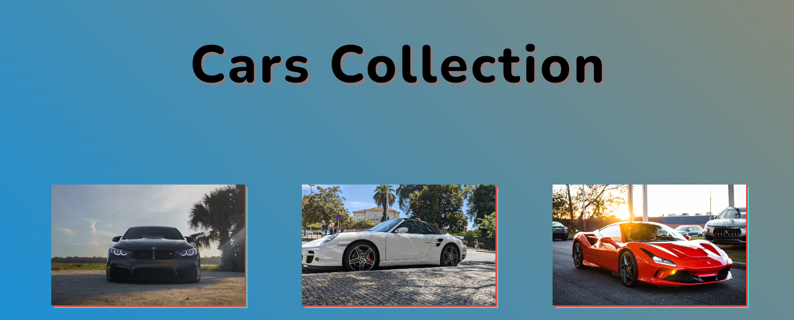
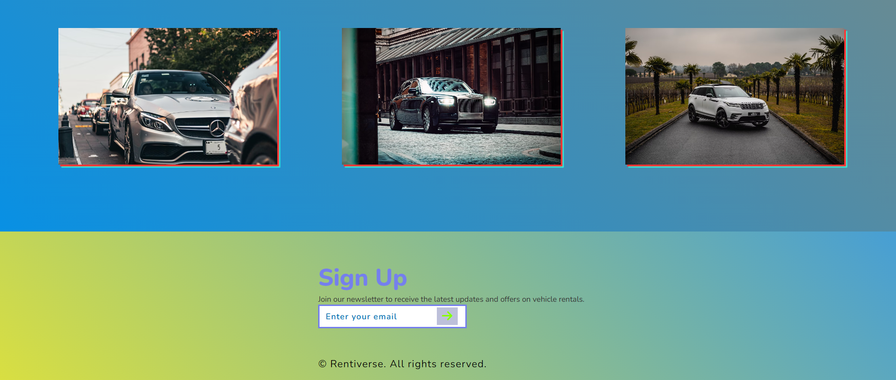

# Rentiverse

> A modern, responsive website showcasing a hypothetical vehicle rental service — from cars to planes — built with plain **HTML, CSS, and vanilla JavaScript**.

---
## 🔭 Live demo
**Live demo :**  
`https://unpredictable-arcane.github.io/Rentiverse-Rent-anything-from-cars-to-private-planes/`

---

## Project description

**Rentiverse** is a clean, multi-page site for a vehicle rental concept. It highlights an image-rich **gallery**, a **slideshow/hero**, a **fixed navbar**, a **custom footer**, and optional **booking UI** — all responsive and performance-conscious so it’s great for a portfolio.

The site is intentionally **static** to enable free hosting and simple forking.

---

**Screenshots**:

## ✨ Features
- Mobile-first, responsive layout (Grid & Flexbox)
- Hero slideshow with autoplay and controls
- Photo gallery with modal/lightbox preview
- Lazy-loading images + `srcset` support
- Booking form UI with client-side validation (no backend)
- Subtle animations and hover microinteractions
- SEO-friendly meta tags and accessible markup (ARIA where needed)

---

## 🛠️ Technology
- **HTML5**
- **CSS3** (Flexbox, Grid, custom properties)
- **JavaScript (ES6+)**
- Optional tools: image optimization (WebP/AVIF), a local dev server

---